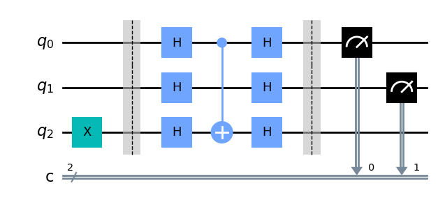

# QOSF Mentorship Program

## Task #1: Finding the largest number

---
### Task Description
1. Compare integers using quantum algorithm and return the larger number.
2. Consider an appropriate number of qubits and explain why your proposal is valid for all kinds of numbers in case 
3. Print your quantum circuit

### Solution implementation
The Bernstein-Vazirani algorithm is a quantum algorithm that finds the hidden bit string of a black box function in a single query. Its most common use is in finding the hidden integer in a list of integers using the oracle. The algorithm has also found applications in areas such as cryptography and machine learning.
I have chosen to use the Bernstein-Vazirani algorithm in this task as opposed to phase estimation or amplitude amplification with Grover's algorithm just for the sake of simplicity.

I divided the task into 3 sub-tasks:

1. Creating The Quantum Circuit:   The quantum circuit that can be used to determine the larger of two input integers using the Bernstein-Vazirani algorithm. This involves initializing three qubits and two classical registers, applying necessary gates such as the Hadamard gate, and applying the Oracle function to the qubits.

2. Applying The Bernstein-Vazirani algorithm : 

    2.1 Hadamard everything!  
    applying superposition on all qubits using what known to be called " the Hadamard's sandwich".

    2.2 Phase Change  
    applying the x gate to the third qubit, before applying the Hadamard gate to all three qubits allows us to distinguish it from the other qubits as it now has a negative phase

    2.3 Applying the Oracle:  
    The third sub-task is to apply the Oracle function to the qubits in the circuit. This involves checking the two input integers and applying the correct controlled-NOT gate to the third qubit that corresponds to "1".

    2.4 Closing the Hadamard's sandwich: The last line of Hadamard's will then transform the “1” qubits to |1⟩ and the rest to |0⟩ ; thereby giving us our random number.

3. Measuring the qubits and obtaining the results:    
    The last sub-task is to measure the first two qubits in the circuit and store the result in the classical register.
    as the result corresponds to the output of the Oracle function, all is left is to return the larger input integer based on the most frequent measurement by determining the index of the larger integer based on the measurement result, and returning the integer at that index.

### References:
1. [A quick intro to the Bernstein-Vazirani algorithm & the phase kick-back ](https://medium.com/nerd-for-tech/one-try-qc-explained-5b466c199616)
2. [Bernstein-Vazirani Algorithm Qiskit textbook](https://qiskit.org/textbook/ch-algorithms/bernstein-vazirani.html)
3. [Bernstein, Ethan, and Umesh Vazirani. "Quantum complexity theory."](https://dl.acm.org/doi/pdf/10.1145/167088.167097)

